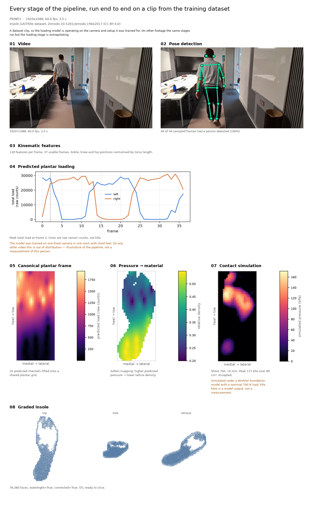
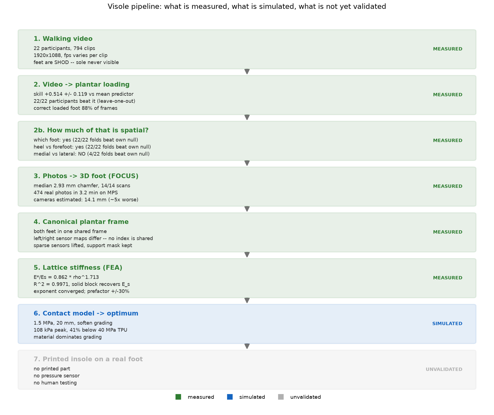
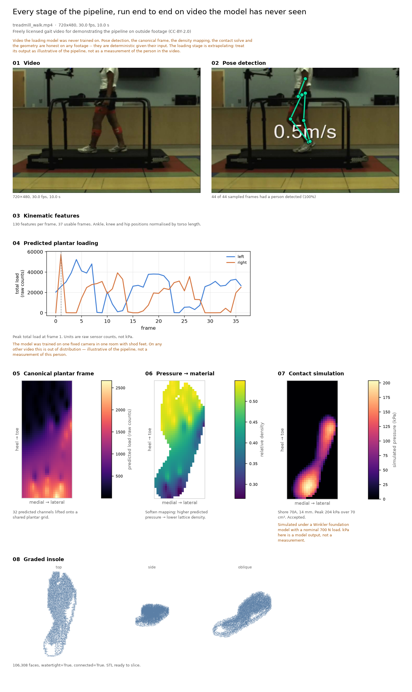
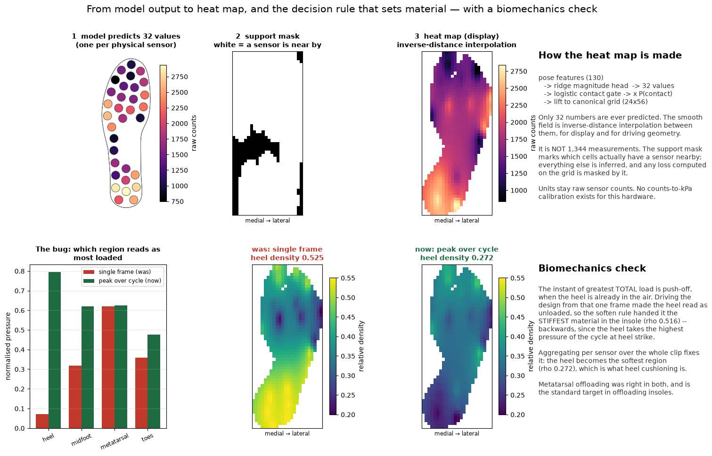
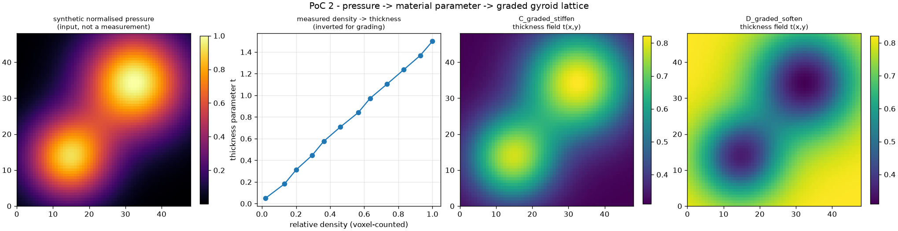
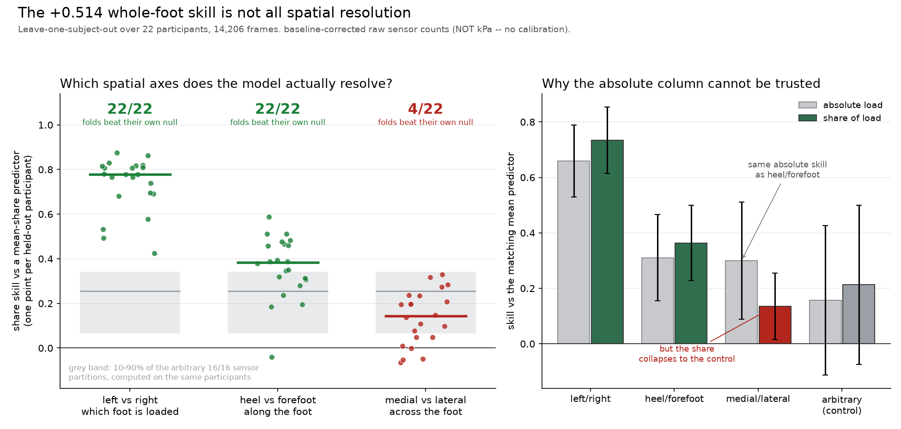
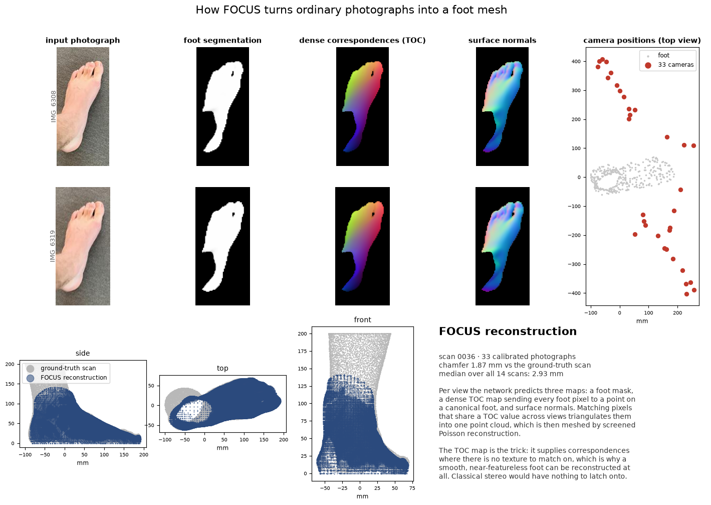
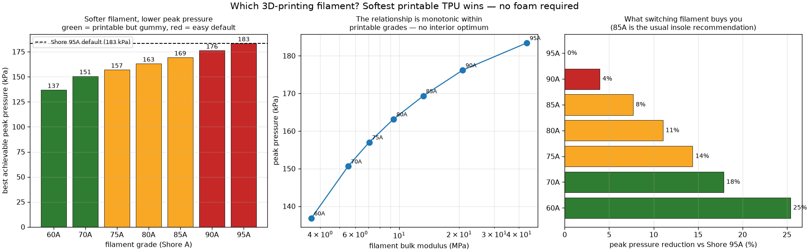
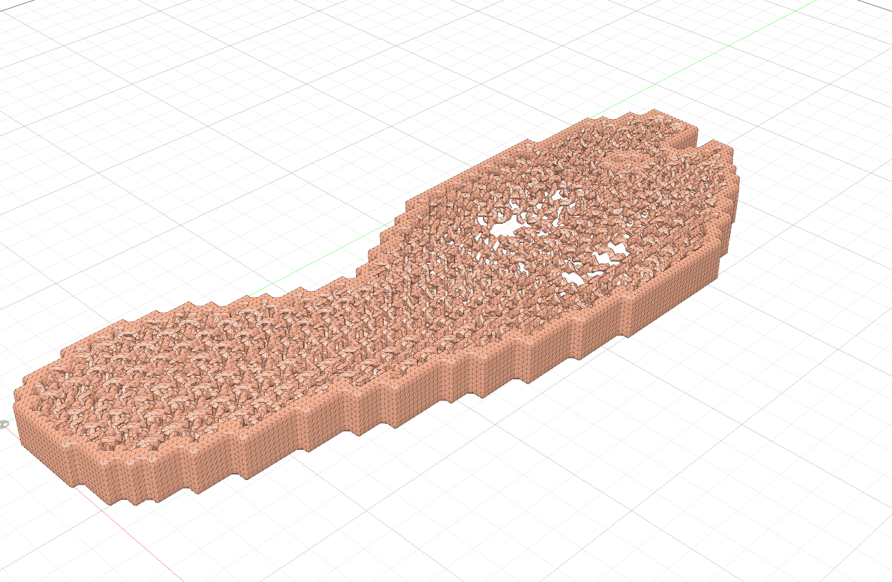
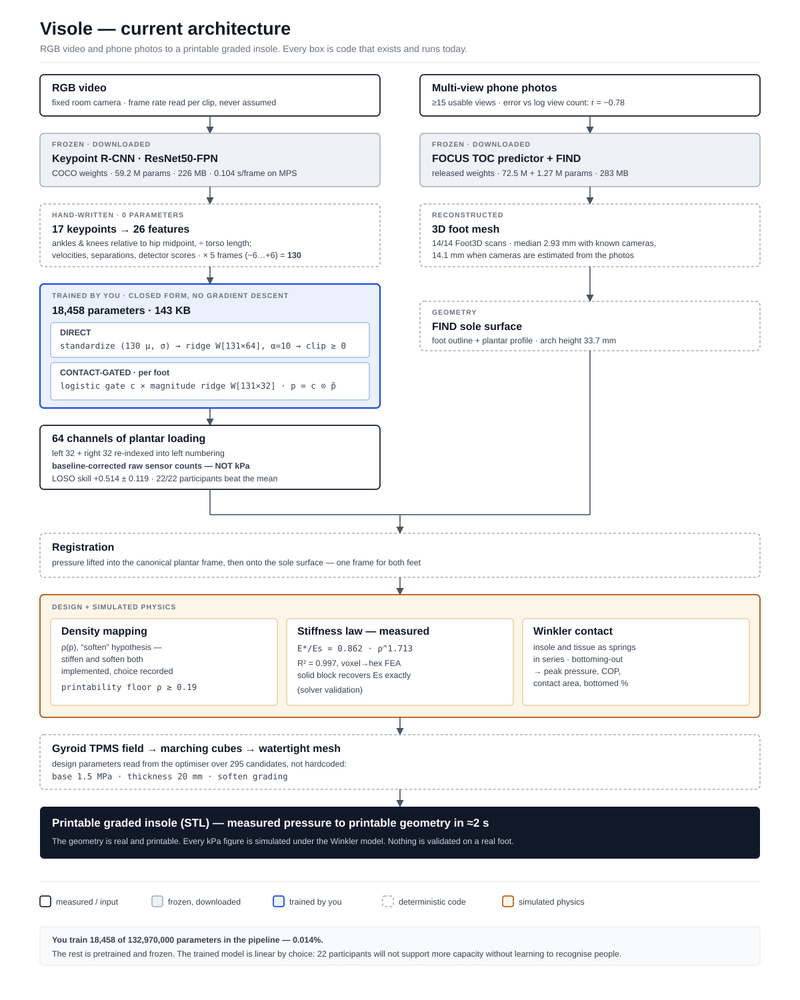

# Visole

**Can an ordinary video of someone walking be turned into a 3D-printable insole
that is graded to their own plantar loading?**

This repository is an attempt to build that chain end to end and to measure how
far each link actually holds:

```
RGB video → pose → limb kinematics → plantar loading → canonical plantar frame
          → material density → contact mechanics → graded lattice insole (STL)
```

Research project for ISEF. Software phase, Apple Silicon, no physical hardware yet.

> **Nothing here has been physically validated.** No insole has been printed, no
> pressure has been measured under a printed part, and no one has walked on one.
> The project labels every claim as *measured*, *predicted*, *simulated* or
> *unvalidated*, and keeps the negative results. See
> [Scientific integrity](#scientific-integrity) and [docs/evidence.md](docs/evidence.md).

---

## The whole pipeline, on one dataset clip

Every panel below is a real output of `scripts/make_demo_run.py`, run on clip
`P9/NP/1` of the published Insole-GAITRite dataset. Nothing is mocked up.



Ten seconds of wall time, from an MP4 to a watertight 76,380-face STL.

---

## Contents

| | |
| --- | --- |
| [What holds and what does not](#what-holds-and-what-does-not) | the evidence ladder |
| [Quick start](#quick-start) | setup, data, first run |
| [Run it on a free video from the web](#run-it-on-a-free-video-from-the-web) | one command, no dataset needed |
| [How each stage works](#how-each-stage-works) | the eight stages, with figures |
| [Why video can predict loading — and the limit that matters](#why-video-can-predict-loading--and-the-limit-that-matters) | the headline number, and its correction |
| [Foot geometry from photographs](#foot-geometry-from-photographs) | FOCUS on Foot3D |
| [From pressure to a printable part](#from-pressure-to-a-printable-part) | lattice, physics, filament |
| [Architecture](#architecture) · [Integrity](#scientific-integrity) · [Data](#data-and-licences) | |

---

## What holds and what does not



Generated by `scripts/make_pipeline_summary.py`, which reads every number from the
experiment JSON rather than from prose, so the figure cannot drift from the results.

The honest summary: **the chain runs, and it narrows.** Video predicts *how much*
load and *which foot* well; it resolves *heel versus forefoot*; it does **not**
resolve medial versus lateral, which is the axis that governs pronation and arch
support. That last finding is the most important thing in this repository and it
is a negative one — see [the ladder](#why-video-can-predict-loading--and-the-limit-that-matters).

---

## Quick start

### Setup

Requires Python 3.10+ (developed on 3.12) and `ffmpeg` on `PATH`.

```bash
git clone <this repo> && cd Insole2
python3.12 -m venv envs/core
envs/core/bin/pip install -e ".[dev]"
brew install ffmpeg            # macOS; probe_video and the sample fetch need it
```

`envs/` and `data/` are deliberately untracked — everything in them is
re-fetchable. Confirm the machine is sane, including the Metal backend:

```bash
envs/core/bin/python scripts/doctor.py       # writes reports/system_report.md
envs/core/bin/python -m pytest tests/        # 157 passing
```

The 3D-reconstruction half needs a second environment (PyTorch3D built from
source, COLMAP, Blender); see [docs/mac_compatibility.md](docs/mac_compatibility.md)
and [docs/focus_mac_port.md](docs/focus_mac_port.md). Everything else runs in
`envs/core`.

### The dataset

```bash
envs/core/bin/python scripts/download_data.py --list
envs/core/bin/python scripts/download_data.py insole_gaitrite --yes   # 1.6 GB, MD5-verified
```

### A first run

```bash
# audit the data before trusting it
envs/core/bin/python scripts/inspect_gait_dataset.py --max-clips 80 --clip P1/FP/1

# video -> insole, all eight stages, previews written to experiments/demo_run/
envs/core/bin/python scripts/make_demo_run.py --clip P9/NP/1
envs/core/bin/python scripts/make_contact_sheet.py experiments/demo_run

# measured pressure -> insole, no video in the loop
envs/core/bin/python scripts/run_visole_pipeline.py --clip P1/FP/1 --side left

# the local dashboard: drag in your own video and watch the stages land
envs/core/bin/python scripts/serve_visole.py        # http://localhost:8420
```

Nothing uploaded to the dashboard leaves the machine; `experiments/live_jobs/` is
gitignored precisely because it may hold someone's personal footage.

---

## Run it on a free video from the web

The pipeline is not tied to the dataset. One command fetches a freely licensed
walking clip and runs the whole chain on it:

```bash
envs/core/bin/python scripts/download_data.py sample_videos          # 3.6 MB
envs/core/bin/python scripts/make_demo_run.py --video data/raw/sample_videos/treadmill_walk.mp4
envs/core/bin/python scripts/make_contact_sheet.py experiments/demo_external
```



All eight stages completed, with a person detected in 44 of 44 sampled frames and
a watertight 106,308-face mesh at the end.

**The clip.** Additional file 1 of Yoon J, Park H-S & Damiano DL, *A novel walking
speed estimation scheme and its application to treadmill control for gait
rehabilitation*, **Journal of NeuroEngineering and Rehabilitation** 9:62 (2012),
[doi:10.1186/1743-0003-9-62](https://doi.org/10.1186/1743-0003-9-62) — CC BY 2.0,
[via Wikimedia Commons](https://commons.wikimedia.org/wiki/File:A-novel-walking-speed-estimation-scheme-and-its-application-to-treadmill-control-for-gait-1743-0003-9-62-S1.ogv).
Declared in [`src/visole/data/registry.py`](src/visole/data/registry.py) with its
size, checksum and licence, like every other download in this project.

### Which stages you should believe on footage like this

This matters more than the pretty output. The loading model was trained on **one
fixed camera, in one room, with 22 shod participants walking toward or away from
it.** The sample clip is a sagittal treadmill view of a different person, and the
camera even crops the head, which degrades the torso-length normalisation the
pose features depend on. So:

| Stage | On arbitrary video | Why |
| --- | --- | --- |
| 1 Video · 2 Pose · 3 Kinematics | **Honest** | A general COCO-trained detector; nothing dataset-specific |
| 4 Predicted plantar loading | **Extrapolating** | Trained on one camera and one room. Illustrative of the pipeline, not a measurement of this person |
| 5 Canonical frame · 6 Density · 7 Contact · 8 Geometry | **Honest given their input** | Deterministic transforms and physics; they faithfully propagate whatever stage 4 hands them |

The pipeline says this on the stage itself rather than in a footnote — it is
recorded as `in_distribution: false` in `experiments/demo_external/demo.json` and
surfaced by both the dashboard and the figure above.

---

## How each stage works

### 1–2. Video → pose

Frames are decoded at a per-clip measured frame rate — never an assumed one. The
published dataset description says 30 fps; most clips are actually 60, and the
rest vary between 28.92 and 30.0. Assuming 30 misaligns video and pressure by up
to 2×.


Pose comes from torchvision's Keypoint R-CNN (ResNet50-FPN, COCO, 17 keypoints),
0.104 s/frame on MPS against 1.14 s/frame on CPU. Only the highest-scoring
detection is kept: one participant walks the walkway.

### 3. Kinematics, not appearance

The participants are **shod**. The plantar surface is never visible in any frame,
so appearance-based approaches (PressureVision and its descendants, which need
bare skin) cannot transfer. What is visible is *motion*, so the features are
ankle, knee and hip trajectories — 26 quantities per frame, all divided by the
subject's own torso length in that frame, plus temporal context at ±3 and ±6
sampled frames, giving 130 features.

That normalisation is not cosmetic: apparent subject size varies roughly
sevenfold along the walkway, and without it the model learns distance from the
camera rather than gait.

### 4–6. Loading → material

The model predicts **32 values per foot** — one per physical sensor. Everything
smooth you see is interpolation for display, not extra measurements.



The right-hand panel records a bug worth keeping: driving the design from the
single frame of greatest *total* load picks push-off, when the heel is already in
the air. The heel then read as unloaded and the soften rule handed it the
*stiffest* material — backwards, since the heel takes the highest pressure of the
cycle at heel strike. Aggregating per sensor over the whole clip fixes it. The
bug was found by a biomechanics sanity check, not by a test.

### 7–8. Contact and geometry

A gyroid TPMS lattice is generated implicitly and meshed by marching cubes. The
density field comes from predicted pressure; the thickness field from a measured
stiffness law; and the design is only exported if a Winkler contact solve says it
does not bottom out under load.



One measured constraint fell out of building this: the gyroid sheet **fragments
into thousands of disconnected islands below ρ ≈ 0.19**, so the density floor is
a printability limit, not a taste parameter.

---

## Why video can predict loading — and the limit that matters

The first attempt failed. Coarse whole-body motion features (silhouette bounding
box, motion energy) scored **+0.009** skill against a mean predictor, and *chance*
on stance-versus-swing. Swapping in ankle/knee/hip pose changed the answer:


**+0.514 ± 0.119** skill against a training-mean predictor, with **22 of 22**
participants beating it under leave-one-subject-out, balanced contact accuracy
0.846 (left) / 0.833 (right), and the more-loaded foot identified correctly on
**88.4%** of frames.

### That number is not what it looks like

A whole-foot skill score cannot distinguish two very different models: one that
knows *where* the load sits, and one that only tracks *how much* total load there
is and spreads it in the average pattern. The second scores well on every
per-sensor metric, because total load explains most of the variance in every
channel at once.

The discriminating test is to divide total load out and score each anatomical
contrast as a **share**, against controls built from arbitrary sensor partitions
computed on the same participant:



| Contrast | Share skill | Beats its own null | Sign test |
| --- | --- | --- | --- |
| left vs right | **+0.734 ± 0.120** | **22 / 22** | p = 4.8 × 10⁻⁷ |
| heel vs forefoot | **+0.364 ± 0.136** | **22 / 22** | p = 4.8 × 10⁻⁷ |
| medial vs lateral | +0.135 ± 0.119 | **4 / 22** | p = 4.3 × 10⁻³ |

**Medial–lateral loading loses to an arbitrary partition of the sensors in 18 of
22 folds.** The absolute column is the trap: at +0.300 it looks indistinguishable
from heel/forefoot, because both are carried by total load.

The consequence is concrete. A pressure-informed insole built on this model can
justify **longitudinal grading only**. Any medial–lateral grading in the exported
geometry would be an artefact of interpolation rather than of measurement, and
that axis is exactly the one an orthotist cares about for pronation and arch
support. The finding propagates through [docs/evidence.md](docs/evidence.md): link
1 cannot resolve it, so no downstream stage can recover it.

Reproduce with `scripts/evaluate_loso.py` and `scripts/evaluate_spatial_ladder.py`;
redraw the figure alone with `--plot-only`.

---

## Foot geometry from photographs

Loading is only half the input — the insole also has to fit a foot. FOCUS
reconstructs a 3D foot from ordinary calibrated photographs, ported here to run
on Apple Silicon.




**14 of 14** scans reconstructed, median **2.93 mm** chamfer against the
ground-truth scans, 474 real photographs in 3.2 minutes on MPS.

Two caveats that decide whether this is usable outside a lab. Given cameras, the
error is 2.93 mm. When COLMAP has to *estimate* the cameras from the same images,
it rises to **14.1 mm** — camera estimation costs roughly 5× the accuracy, which
is the single biggest unknown in a phone-based capture. And reconstruction
quality tracks coverage: corr(log usable views, chamfer error) = **−0.78**, so the
practical rule is at least ~15 views with the foot clearly segmented.

---

## From pressure to a printable part

Stiffness is not assumed. A voxel-to-hex FEA compression test on the generated
lattice measures it:

> **E\*/Es = 0.862 · ρ^1.713** (R² = 0.9971; the exponent is converged, the
> prefactor carries about ±30%)

With that law, a Winkler foundation model answers the design question — and shows
that an optimum exists because of bottoming-out physics, not because of a tuning
preference:




The uncomfortable result: **material choice dominates grading.** Moving from
Shore 90A to Shore 60A changes peak simulated pressure more than the grading
hypothesis does. And the pressure→density direction — stiffen under load, or
soften under it — remains an **open hypothesis**; both are implemented, and the
choice is recorded in every export.

The end of the chain is a real part. `scripts/run_visole_pipeline.py` takes
measured pressure to a watertight, printable STL in 1.7 s, cross-checked in
Fusion 360:



Every kPa figure above is **simulated** under the Winkler model. The measured
insole data is in raw sensor counts and supplies only the load shape and the
centre of pressure. No claim is made that this insole improves anything on a real
foot.

---

## Architecture



The dashboard (`scripts/serve_visole.py`, stdlib only) builds its payload by
reading the experiment JSON off disk, so the site always reflects the actual
results rather than a hand-written copy of them.

---

## Scientific integrity

Rules enforced in code and tests, not just prose:

- Pressure values are **raw sensor counts**, never kPa — no calibration exists
  for this hardware.
- Interpolated heatmaps are **display only** and never counted as extra
  measurements; the support mask records which cells actually have a sensor.
- Splits are **by participant**; the `Split` class raises if a participant
  appears in two of them.
- `left[i]` and `right[i]` are **never** the same anatomical site. The two insoles
  are a pixel-exact mirror, but not one of the 32 indices denotes the same
  location on both feet — `SensorMap.to_other_foot()` is the only correct mapping.
- Frame rate is **read per clip**, never assumed.
- The pressure→density direction is an **open hypothesis**; both are implemented.
- Binning is lossy, so `quantisation_error()` reports the cost.
- Failed and negative results are kept — the +0.009 motion-feature result and the
  medial–lateral failure are both in here.

### Known inconsistencies

Recorded rather than quietly fixed:

- `src/visole/pipeline/live.py` hardcodes its design point (Shore 70A, 14 mm)
  while `scripts/run_visole_pipeline.py` reads 1.5 MPa / 20 mm from
  `insole_optimum.json`. The two paths emit different insoles from the same physics.
- `extract_clip_pose` stops once it has `max_frames` samples and never seeks, so
  only the opening seconds of a long video are analysed. The sample clip is
  trimmed at fetch time to work around this.

---

## Repository map

```
src/visole/
  compute/device.py        single source of truth for MPS/CPU; no module assumes CUDA
  data/registry.py         every download declared with size, checksum, licence, purpose
  data/insole_gaitrite.py  dataset index and loader; fps measured per clip
  data/splits.py           participant-disjoint splits that raise on overlap
  models/pose_features.py  Keypoint R-CNN -> 130 torso-normalised kinematic features
  pipeline/live.py         the eight-stage chain, run on any video
  pressure/sensor_map.py   sensor geometry parsed from the dataset's own SVGs
  pressure/bins.py         nine ordered log-spaced pressure bins
  lattice/implicit.py      gyroid/Schwarz TPMS -> marching cubes -> watertight STL
  lattice/mapping.py       pressure -> density, as competing hypotheses
  lattice/stiffness.py     voxel->hex FEA; measures E*/Es = 0.862*rho^1.713
  registration/contact.py  Winkler foundation: foot pressing into the insole
  visualization/           plots that label measured vs interpolated

scripts/     24 argparse CLIs, one per pipeline step (see Quick start)
experiments/ results, figures and per-experiment READMEs — the evidence
adapters/    FOCUS-on-macOS shim; Fusion 360 geometry bridge
web/         the dashboard front end, served by scripts/serve_visole.py
```

---

## Data and licences

| Dataset | Use | Licence |
| --- | --- | --- |
| [Insole-GAITRite](https://doi.org/10.5281/zenodo.19662017) — 22 participants, 794 clips, synchronised video + 32-channel insoles at 64 Hz + GAITRite at 180 Hz | Primary video→pressure dataset | CC-BY-4.0 |
| [Foot3D multiview](https://github.com/OllieBoyne/Foot3D) — 14 scans, 474 calibrated photographs | FOCUS reconstruction benchmark | Research use; access via the authors' form |
| [Treadmill gait clip](https://commons.wikimedia.org/wiki/File:A-novel-walking-speed-estimation-scheme-and-its-application-to-treadmill-control-for-gait-1743-0003-9-62-S1.ogv) — Yoon, Park & Damiano, J NeuroEng Rehabil 9:62 (2012) | Out-of-distribution demonstration | CC BY 2.0 |

None are redistributed here. `scripts/download_data.py` fetches and verifies what
it can; Foot3D is gated behind the authors' own form. Every entry, with its
checksum and purpose, is declared in
[`src/visole/data/registry.py`](src/visole/data/registry.py), and every external
resource is listed in [docs/sources.md](docs/sources.md).

---

## Documentation

| Document | Contents |
| --- | --- |
| [docs/evidence.md](docs/evidence.md) | **Every claim, labelled; the error budget; what is not proven** |
| [IMPLEMENTATION_PLAN.md](IMPLEMENTATION_PLAN.md) | What runs on MPS, CPU and external tools; milestone status |
| [docs/sources.md](docs/sources.md) | Every external resource, verified against provider APIs |
| [docs/physics_model.md](docs/physics_model.md) | The stiffness law and the Winkler contact model |
| [docs/reflection.md](docs/reflection.md) | Engineering retrospective — what went wrong and why |
| [docs/pressurevision_to_foot.md](docs/pressurevision_to_foot.md) | What transfers from PressureVision++, what does not |
| [docs/hand_pressure_papers_to_foot.md](docs/hand_pressure_papers_to_foot.md) | The hand-pressure literature, applied to feet |
| [docs/lattice_stack_decision.md](docs/lattice_stack_decision.md) | Why an in-house implicit engine instead of nTop |
| [docs/focus_mac_port.md](docs/focus_mac_port.md) · [docs/mac_compatibility.md](docs/mac_compatibility.md) · [docs/upstream_modifications.md](docs/upstream_modifications.md) | Running FOCUS, PyTorch3D, COLMAP and Blender on Apple Silicon |
| [experiments/gait_dataset_audit/](experiments/gait_dataset_audit/README.md) | Dataset audit and corrections |
| [experiments/pressure_baseline/](experiments/pressure_baseline/README.md) | Baselines, LOSO and the spatial ladder |
| [experiments/focus_baseline/](experiments/focus_baseline/README.md) | FOCUS on Foot3D, and on Blender renders |
| [experiments/insole_physics/](experiments/insole_physics/README.md) | Stiffness calibration, optimisation, filament choice |
| [reports/system_report.md](reports/system_report.md) | Machine audit |

---

## Citation and licence

Code is MIT licensed — see [LICENSE](LICENSE). Datasets keep their own licences,
listed above. If you use this work, see [CITATION.cff](CITATION.cff).
