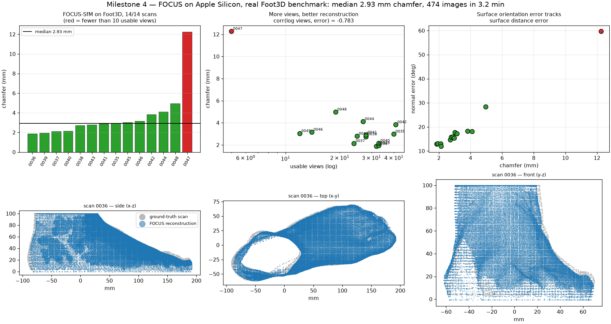

# Milestone 4 — FOCUS foot reconstruction on Apple Silicon

**Result: 14 of 14 Foot3D scans reconstructed, median chamfer 2.93 mm, whole
benchmark in 3.2 minutes.** The Mac port is complete and now *measured*, not
just "it runs".

```bash
envs/focus/bin/python scripts/run_focus_demo.py --check
envs/focus/bin/python scripts/run_focus_foot3d.py --all
```

---

## Benchmark

Foot3D `Multiview`: 14 scans, **474 real calibrated photographs**, each scan with
a ground-truth 3D scan. Evaluated with **FOCUS's own protocol**
(`FOCUS.eval.eval`): both meshes cropped at z = 0.1 m, 10,000 surface samples,
point-to-**surface** distance, seed 0.

| scan | views used / images | chamfer (mm) | normal err (°) |
| --- | --- | --- | --- |
| 0036 | 32/33 | **1.87** | 12.9 |
| 0039 | 33/34 | 1.93 | 13.0 |
| 0037 | 24/24 | 2.12 | 13.0 |
| 0040 | 33/33 | 2.15 | 11.9 |
| 0038 | 28/28 | 2.73 | 14.6 |
| 0043 | 25/39 | 2.79 | 15.7 |
| 0041 | 28/29 | 2.89 | 15.9 |
| 0035 | 40/40 | 2.98 | 15.3 |
| 0045 | 12/35 | 3.02 | 17.7 |
| 0046 | 14/30 | 3.15 | 17.2 |
| 0042 | 41/48 | 3.83 | 18.2 |
| 0044 | 27/30 | 4.10 | 18.1 |
| 0048 | 19/39 | 4.97 | 28.3 |
| 0047 | **5**/32 | **12.27** | 59.7 |

- **All 14 scans**: mean 3.63 mm, median 2.93, range 1.87–12.27
- **13 scans with ≥10 usable views**: mean **2.96 mm**, median 2.89, range 1.87–4.97
- 8/14 under 3 mm; 13/14 under 5 mm



## The one failure is explained, not excused

Scan 0047 kept only **5 of 32 views** (16 %) after the 2 % mask-coverage filter,
and produced the worst reconstruction by a factor of 2.5 (12.27 mm, 59.7°
normal error). It is not a random outlier: across the benchmark,

> **corr(log usable views, chamfer error) = −0.783**

More usable views, better reconstruction. The practical rule for Visole's own
future captures: **aim for at least ~15 views where the foot is clearly
segmented**, and check coverage before trusting a reconstruction.

## Why COLMAP was skipped, and why that is legitimate

Foot3D ships a per-scan `colmap.json` that is *already* in the format FOCUS's own
`colmap2pytorch3d` emits — same `camera` block, same per-image `R`/`C`/`T`. So
`scripts/run_focus_foot3d.py` splits it per view and hands FOCUS known-good
cameras.

This is the dataset's provided calibration, not something we invented, and it
isolates what we set out to measure: **reconstruction quality, not camera
estimation**. Running COLMAP itself remains verified separately (4.1.1, no CUDA)
but was the stage that failed on synthetic renders, so removing it removes a
confound.

## Speed

| stage | device | time |
| --- | --- | --- |
| TOC prediction, 474 images | **MPS** | 76 s (~160 ms/image incl. I/O) |
| Fusion, 14 scans | CPU | 118 s |
| **Total benchmark** | | **3.2 min** |

## What had to be fixed

Two upstream patches, both recorded in
[upstream_modifications.md](../../docs/upstream_modifications.md):

1. `array.tostring()` → `.tobytes()` (removed in NumPy 2.0).
2. **An OpenMP logic bug.** `remeshing._setup_meshlab()` reads
   `if os.environ.get("KMP_DUPLICATE_LIB_OK", "True"):` — always true, since a
   non-empty string is truthy, `"False"` included — then sets the flag to
   `"False"`. On this machine torch's libomp is already initialised, so
   disabling duplicate tolerance made libomp `abort()` the process at the first
   Poisson reconstruction. Setting it to `TRUE` is safe here because meshlab is
   pinned to a single thread on both switches, so the two runtimes never
   schedule concurrently.

Also needed: `rtree` (trimesh's spatial index, required by
`trimesh.proximity.closest_point`) and `shapely` (mesh slicing).

## Honest limits

1. **Ground-truth cameras were used.** These numbers measure reconstruction from
   *known* viewpoints. An end-to-end phone capture also has to estimate cameras,
   and COLMAP is where synthetic renders failed. Expect worse in the wild.
2. **14 scans is a small benchmark**, and one already fails.
3. **No comparison against the paper's published figures.** We used their
   evaluation code, but have not verified our numbers reproduce theirs on the
   same split, so this is "FOCUS works on Mac at ~3 mm", not "we reproduced the
   paper".
4. Feet here are **bare and photographed deliberately** — unlike the shod,
   distant feet in the gait dataset. The two halves of Visole still meet only
   through the canonical plantar frame, not through shared imagery.

## What this unlocks

A measured 3 mm foot reconstruction is accurate enough to carry a pressure map:
sensor spacing on the insole is ~20 mm, so geometry is no longer the limiting
factor. Milestone 7 (registration) can now proceed against a real reconstructed
foot instead of a synthetic stand-in, using the `templ_sole_faces.npy` plantar
labelling that ships with FOCUS.
