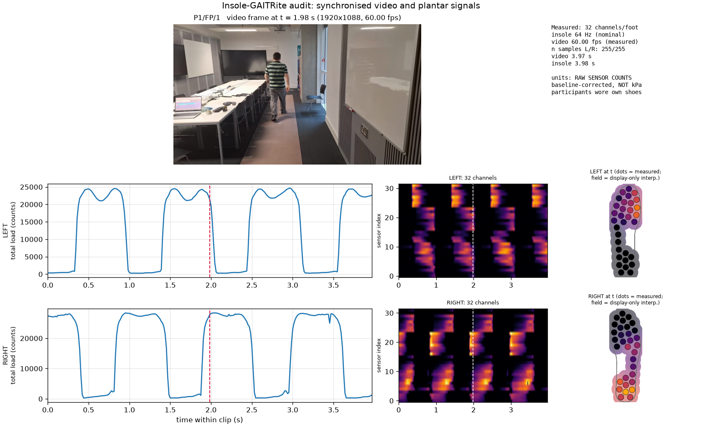

# Milestone 2 — Insole-GAITRite dataset audit

**Date:** 2026-08-30 · **Machine:** Apple M1 Max, 64 GB, macOS 26.5.2 (arm64)
**Dataset:** [10.5281/zenodo.19662017](https://doi.org/10.5281/zenodo.19662017), CC-BY-4.0,
1,686,755,134 B archive — all three files verified against the publisher's MD5s.

Reproduce:

```bash
envs/core/bin/python scripts/inspect_gait_dataset.py --max-clips 80 --clip P1/FP/1
```

Outputs: `outputs/audit_stats.json`, `outputs/sync_P1_FP_1.png`.

---

## Verdict

The dataset is clean, well organised and usable. **But the video does not show
what a naive reading of the project plan assumed**, and three documented
properties are wrong or incomplete. Both matter before any model is trained.

## 1. What is actually in the release

| property | value | source |
| --- | --- | --- |
| Participants | **22** (P18 and P22 absent from P1..P24) | counted |
| Clips | **794** total | counted |
| By condition | SP 228, NP 219, FP 217, STAND 65, SITDOWN 65 | counted |
| Video | 1920×1088, all 80 sampled clips | measured |
| Insole channels | 32 + accel(3) + gyro(3) + copX, copY, sumP = 41 columns | header |
| NaNs | **0** in 42,569 sampled rows | measured |
| Pressure values | integers, 17 … 3437 | measured |

The Zenodo description says 23 participants were recorded; only those meeting
quality criteria were released. Code must **count** participants, never assume.

## 2. Three corrections to the published description

### 2.1 Frame rate is heterogeneous — "30 fps" is wrong for most clips

Across 80 sampled clips:

```
60.00 fps : 48 clips
30.00 fps :  7        29.50 fps : 2
29.58 fps :  7        29.25 fps : 1
29.17 fps :  6        28.92 fps : 1
29.00 fps :  4
29.33 fps :  4
```

Most clips are **60 fps**, and the remainder are *not* exactly 30 — they vary
between 28.92 and 30.0. Converting a frame index to a time with `i / 30` would
misalign video and pressure by up to a factor of two. `probe_video()` reads the
real rate per clip and nothing in Visole assumes a constant.

### 2.2 There are no timestamps in the insole CSVs

The insole files carry no time column. Clip timing rests on the nominal 64 Hz.
Fortunately the clips are pre-trimmed consistently:

```
insole_duration / video_duration :  min 0.997   median 1.003   max 1.018
```

So within a clip, relative time is a sound alignment for a first pass. This is
an empirical finding about *these* clips, not a guarantee.

### 2.3 `sync_auto.json` describes the parent session, not the clip

Fields are `offset_seconds`, `intervals`, `total`, per foot. `intervals` sum
exactly to `total`, and the magnitudes (~2.8×10⁶ and ~3.4×10⁶, differing between
feet) are consistent with **milliseconds of the whole recording session**
(≈47 and ≈56 min), not this ~4 s clip. `offset_seconds` (≈ −31.7 s) is
presumably the alignment offset, but **its sign convention and reference stream
are undocumented**. Visole does not rely on it yet; it uses within-clip relative
time and flags this for verification against
[GaitScope](https://github.com/MarcosRM02/GaitScope).

## 3. Signal properties that change how the data must be used

**The unloaded baseline is non-zero and varies per clip.** The 5th percentile of
each clip ranged 20 … 59 counts (median 22) in this sample, and up to 187 in a
wider one. A single global offset is wrong; `estimate_baseline()` works per clip.

**`sumP` is the raw sum including that baseline.** Verified exactly:
`max |Σ(32 channels) − sumP| = 0.000`. Using `sumP` as "total load" silently
includes ~32 × baseline of offset. Baseline-correct first.

**Units are raw sensor counts.** No subject-specific calibration was performed,
so there is no counts→kPa mapping. Nothing in this project may print these as kPa.

## 4. The sensor maps contain a serious trap

Both SVGs derive from the same `Insole_RightSensors-brd.dxf`; the left file is
the right geometry inside a `matrix(-1,0,0,1,613.96011,0)` mirror. Their
`sodipodi:docname` attributes are swapped relative to their filenames, which
initially suggested the sides might be mislabelled. They are not — the geometry
settles it, and the filenames are correct.

**The real hazard is the numbering.** The pad geometry mirrors *exactly*
(max deviation 0.00 units), but the two insoles use **different sensor indices**:

```
R0 ->L15   R1 ->L12   R2 ->L13   R3 ->L14
R4 ->L10   R5 ->L8    R6 ->L11   R7 ->L9
R8 ->L4    R9 ->L5    R10->L6    R11->L7
R12->L19   R13->L1    R14->L2    R15->L3
R16->L30   R17->L28   R18->L29   R19->L31
R20->L24   R21->L25   R22->L26   R23->L27
R24->L20   R25->L21   R26->L22   R27->L23
R28->L16   R29->L18   R30->L17   R31->L0
```

**Not one of the 32 indices refers to the same anatomical site on both feet.**
Concatenating `left[32] + right[32]` and assuming symmetry, or averaging the two
feet channel-by-channel, silently scrambles the anatomy. `SensorMap.to_other_foot()`
is the only correct way to compare feet, and `tests/test_sensor_map.py` asserts
the property.

### The geometry is independently validated

The 32 pad centroids were recovered by chaining 262 open Bézier segments into
closed loops (all ~3157 svg u², a 1 % spread). Using them to compute a
pressure-weighted centroid reproduces the **device's own `copX`/`copY`**:

| | r (copX) | r (copY) | scale |
| --- | --- | --- | --- |
| left | +0.9989 | +0.9995 | ≈0.479 |
| right | +0.9973 | +0.9996 | ≈0.480 |

A single isotropic scale on both axes and both feet. This confirms the pad
extraction, the label assignment and the mirror handling at once. The physical
unit of the device frame remains unverified, so positions stay in SVG units and
normalised foot coordinates — **not millimetres**.

## 5. What the video actually shows — the finding that reshapes RQ2



A single fixed wide-angle camera films a room; participants walk a GAITRite
walkway **toward or away** from it (both directions occur across clips). Faces
are blurred. Then:

1. **Every participant is shod** — they wore their own footwear by design.
   The plantar surface is *never* visible in any frame.
2. **Apparent foot size varies roughly sevenfold** with distance, from a few
   hundred pixels at the near end to ~50 px at the far end.
3. Motion blur is significant on the swinging foot, especially at fast cadence.

This is a real constraint on the project's framing:

> **PressureVision works because a bare hand fills the frame and skin blanching
> is directly observable. Neither condition holds here.** What this video does
> carry is whole-body and limb *kinematics* — gait phase, cadence, contact
> timing. That is the **UnderPressure** paradigm (motion → force), not the
> PressureVision paradigm (appearance → pressure).

Consequences, carried into [IMPLEMENTATION_PLAN.md](../../IMPLEMENTATION_PLAN.md):

- The kinematics baseline is not a warm-up for a CNN; on this dataset it is the
  scientifically motivated primary method.
- A "foot crop CNN" is worth testing but is a test of *shoe and limb appearance*.
  It must never be described as estimating pressure from the plantar surface.
- Ordered pressure bins, weak contact labels and participant-disjoint evaluation
  transfer from PressureVision++ regardless, because they are about supervision
  structure rather than about skin.

## 6. Signals look biomechanically correct

In `outputs/sync_P1_FP_1.png` (P1/FP/1, t = 1.98 s) the left foot shows forefoot
load with an unloaded heel (push-off) while the right shows heel load with an
unloaded forefoot (heel strike) — textbook double support. Total-load traces
alternate cleanly between feet. The data behaves as gait data should.

## 7. Open questions for the next session

1. Confirm the `sync_auto.json` `offset_seconds` convention against GaitScope.
2. Establish whether the device coordinate unit for `copX`/`copY` is millimetres.
3. Quantify foot bounding-box size in pixels across the corpus (needs a detector)
   to decide whether a foot-crop CNN is viable at the far end of the walkway.
4. Check GAITRite `Foot` (0/1) against the L/R insole channels to confirm which
   value denotes which foot before using GAITRite events as labels.
