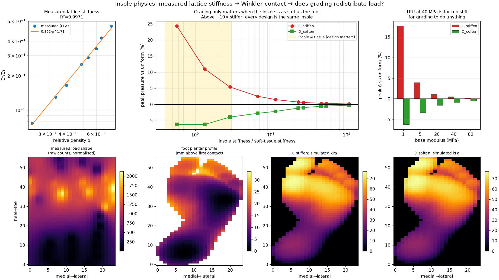
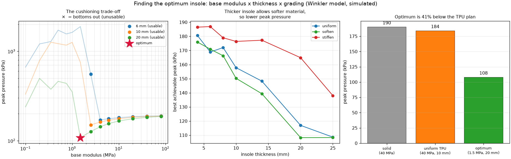

# Insole physics — does a graded lattice actually redistribute load?

**Answer, within this model: softening under high pressure lowers peak pressure,
stiffening raises it — but only when the insole is nearly as soft as the foot's
own tissue. At the TPU stiffness we were planning to print, the effect is under
1% and the design choice is irrelevant.**

That second half is the useful engineering result.

```bash
envs/core/bin/python scripts/calibrate_lattice_stiffness.py --resolution 10 --convergence
envs/core/bin/python scripts/simulate_insole_designs.py --sweep-modulus
```

---

## 1. Lattice stiffness, measured not assumed

Numerical compression test on a 3×3×3-cell gyroid, TPU (E_s = 40 MPa, ν = 0.45):

> **E\*/Es = 0.862 · ρ^1.713**, R² = 0.9971

Solver validated: a solid block recovers its input modulus exactly
(E_eff/E_s = 1.00000). Half-resolution changes the exponent by 2% but the
prefactor by 30% — see [physics_model.md](../../docs/physics_model.md).

## 2. The result

Driven by a **real measured** pressure field (P1/FP/1 left foot, peak-load frame)
and the **real plantar profile** of the FIND template. Every design carries 700 N
through the same centre of pressure, so only the distribution can differ.

Peak pressure relative to a uniform lattice:

| base modulus | insole h | k_insole/k_tissue | stiffen | soften |
| --- | --- | --- | --- | --- |
| 1 MPa | 14 mm | **0.6** | +24.3% | **−6.2%** |
| 1 MPa | 6 mm | 1.3 | +11.0% | −6.2% |
| 5 MPa | 14 mm | 2.9 | +5.4% | −3.9% |
| 5 MPa | 6 mm | 6.7 | +2.5% | −2.8% |
| 20 MPa | 14 mm | 11.5 | +1.5% | −2.2% |
| **40 MPa (TPU)** | 14 mm | **22.9** | +0.7% | **−1.1%** |
| 40 MPa | 6 mm | 53.5 | +0.3% | −0.5% |
| 80 MPa | 6 mm | 107 | +0.2% | −0.2% |



### Two findings

**(a) Soften wins — the hypothesis now has a simulated answer.** Reducing density
under high-pressure regions lowers simulated peak pressure in *every* condition
tested (−0.2% to −6.2%). Stiffening raises it (+0.2% to +24.3%). A solid insole
is worst of all (mean +9.8%, up to +47.8%).

The mapping direction that `src/visole/lattice/mapping.py` deliberately refused
to guess now has evidence behind it — under this model, and only under it.

**(b) The effect is governed by one dimensionless number.** All of the variation
collapses onto `k_insole / k_tissue`. Above roughly 10, the plantar soft tissue
is so much more compliant than the insole that it absorbs essentially all the
deformation, and grading the lattice changes nothing.

**This is the actionable part.** A gyroid in 40 MPa TPU at printable density
(ρ ≥ 0.20) sits at a ratio of 23–54. It is *far too stiff for grading to matter*.
To reach the regime where the design does something you need:

- a base material around **1–5 MPa** (foam-like, not rigid TPU), or
- densities below the ρ ≈ 0.19 connectivity floor, which will not print, or
- a much thicker insole than 14 mm.

Choosing the print material therefore matters more than choosing the grading law.

## 3. The optimum

```bash
envs/core/bin/python scripts/optimize_insole.py
```

Searching base modulus x thickness x grading over 295 designs, with the real
plantar profile and a real measured load field:

> **Optimum: 1.5 MPa base material, 20 mm thick, soften grading -> 108 kPa peak.**
> That is **41% below** a uniform 40 MPa TPU insole (184 kPa) and **43% below**
> solid (190 kPa).

At a more practical thickness the answer shifts but survives: **2.5 MPa at 10 mm
-> 150 kPa**, still 19% better than the TPU plan.



### Why there is an optimum at all

Earlier the model said "softer is always better", which is a boundary answer and
a sign of missing physics. What was missing is **bottoming out**: a cellular solid
compressed past its densification strain (~0.6) has its cell walls meet, stiffens
sharply, and transmits load like the rigid sole underneath.

With that included, two effects oppose each other and the optimum becomes interior:

| base modulus (20 mm insole) | peak kPa | bottomed |
| --- | --- | --- |
| 0.10 MPa | 239 | 32% |
| 0.50 MPa | 461 | 13% |
| 1.00 MPa | 352 | 5% |
| **1.50 MPa** | **108** | **0%** |
| 2.50 MPa | 127 | 0% |
| 10.0 MPa | 166 | 0% |
| 80.0 MPa | 187 | 0% |

The optimum sits exactly at the edge of bottoming out — which is where a good
cushion should sit: using all the available compression and no more. A boundary
check confirms it is interior in both modulus and thickness, not pinned to the
edge of the search.

A subtlety worth recording: the densification limit applies to the **insole's own**
compression, not the total indentation. Springs in series share displacement, so
charging the whole indentation to the insole (which the first implementation did)
hides bottoming out entirely — no design registered as bottomed and the optimum
ran away to zero stiffness again.

### What this means for the build

Thicker helps, because it lets you go softer before bottoming out. But the
dominant variable is the **material**, not the lattice grading: moving from 40 MPa
TPU to a ~1.5-2.5 MPa foam-like base is worth ~40%, while the grading law is worth
a few percent on top. Grading is the refinement; material choice is the decision.

## 4. How a null result turned into a finding

The first run returned peak pressure of 77.2 kPa for **every** design — including
solid, which is ~50× stiffer than a ρ=0.2 lattice. That is not a plausible
physical result, so it was treated as a bug rather than a finding.

Cause: `k_tissue` was set to 2×10⁶ Pa/m, ten times too soft. That allowed 21 mm of
indentation — more than the 33.7 mm arch minus the insole thickness — so the
entire foot registered as in contact and the series stiffness pinned to the
tissue everywhere.

Fixing it revealed the real mechanism, which is the stiffness ratio above. In a
series-spring model the softer element dominates, so an error in the soft term
silently erases the effect being measured. Worth remembering.

## 5. Limits

1. **Winkler foundation**: no shear, no plate bending, no in-plane coupling.
2. **Linear elastic, quasi-static**: TPU is viscoelastic; walking is dynamic.
3. **Rigid foot** apart from one lumped tissue spring.
4. **`k_tissue` is a literature-order parameter**, not measured for these
   participants — and the results depend on it directly.
5. **The direction of (a) is partly structural.** In a series-spring model a
   softer element under a fixed load will tend to carry less pressure. The
   informative outputs are the *magnitude* and the *stiffness-ratio threshold*,
   not the bare sign.
6. **Simulation only.** No printed insole, no pressure sensor, no person. Nothing
   here is a claim about real feet.
7. **The optimum inherits every assumption above**, and the densification strain
   (0.6) and densification factor (50x) are model constants, not measurements of
   any printed lattice. A compression test on a printed coupon would replace both.

## 6. Next

- Cross-check one case against an independent solver — the Fusion bridge in
  `adapters/fusion/visole_import.py` (written, **not yet run**).
- Re-run once a print material is chosen; if it is foam-like, grading matters and
  the whole comparison should be redone at that modulus.
- Inverse dynamics, still deferred: the dataset has no body mass or height, so it
  could only ever produce mass-normalised forces.
