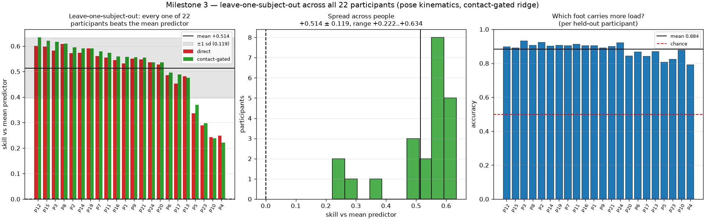
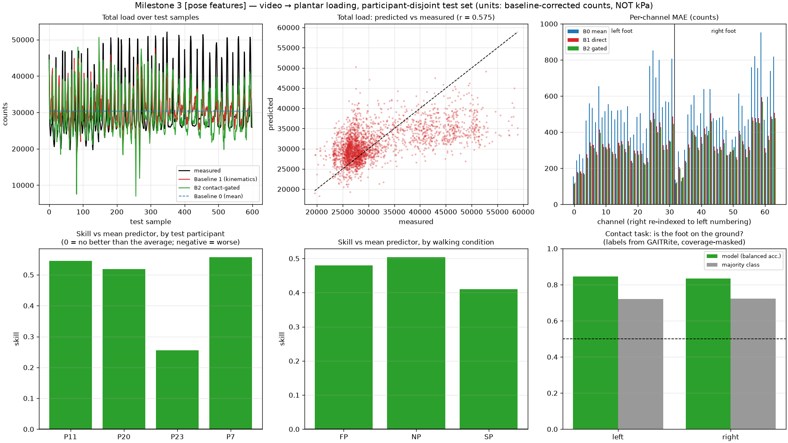

# Milestone 3 — can ordinary video predict plantar loading?

**Date:** 2026-08-31 · Apple M1 Max, MPS · participant-disjoint evaluation
**Units:** baseline-corrected raw sensor counts. **Not kPa** — no calibration exists.

```bash
envs/core/bin/python scripts/extract_pose.py --clips-per-cell 3 --stride 3
envs/core/bin/python scripts/train_pressure_baseline.py --features pose --frame-stride 1
envs/core/bin/python scripts/evaluate_pressure_model.py --tag pose
```

---

## Answer

**Yes — but only from limb kinematics, not from coarse whole-body motion.**

The same targets, the same split and the same model, changing only how much limb
detail the features carry:

| | B0 mean | **1a** coarse motion | **1b** pose kinematics | **1b + contact gate** |
| --- | --- | --- | --- | --- |
| Skill vs mean predictor | 0 | **+0.009** | **+0.452** | **+0.463** |
| MAE (counts) | 512 | 507 | 337 | **320** |
| RMSE (counts) | 643 | 640 | 476 | **471** |
| total-load *r* | — | 0.122 | **0.575** | 0.569 |
| mean per-channel *r* | — | 0.091 | 0.638 | **0.649** |
| COP error (svg units) | 178 | 175 | 143 | **128** |
| Contact, balanced acc. | — | **0.510** (chance) | **0.846 / 0.833** | — |

Skill rises **52×** between 1a and 1b. Stance/swing classification goes from a
coin flip to 0.846 balanced accuracy against a 0.720 majority-class floor.

The most interpretable number: the model identifies **which foot is carrying
more load on 87.3 % of frames**.

## Why 1a failed, and why that mattered

Baseline 1a used background subtraction and a person-sized bounding box:
position, size, and motion energy in a "foot band". It beat predicting the
average by 0.9 %, and two of four test participants scored *negative*.

Before reporting that as a fact about video, a diagnostic asked which single
feature best separated stance from swing. The answer was **a different feature
in every clip** (`cx`, then `foot_motion`, then `bbox_area`), with Cohen's
d ≈ 0.2–1.1. That is the signature of clip-specific coincidence, not a
transferable signal. A box drawn around a whole person cannot express which leg
is loaded.

With pose features the same diagnostic gives d ≈ 1.5–3.2 and the **same**
features on top across clips — ankle and knee positions. Consistency across
clips, not just magnitude, is what separates signal from coincidence.

**The lesson: the first negative result was a statement about the features, not
about video.** It would have been easy, and wrong, to publish it as the latter.

## Method

*Features (1b).* torchvision Keypoint R-CNN (COCO, 17 keypoints), `min_size=480`,
195 clips at stride 3 — 15,571 frames in 105 min on MPS. Ankles, knees and hips,
expressed relative to the hip midpoint and **divided by the subject's torso
length in that frame**. Apparent size varies ~7× along the walkway, so without
that normalisation the features encode distance from the camera and the model
learns the room. Five-frame temporal context (offsets −6…+6) → 130 features.

*Targets.* 64 channels: the left foot's 32 sensors, then the right foot's 32
**re-indexed into the left foot's numbering**. The two insoles do not share
numbering — not one of the 32 indices is the same anatomical site on both feet —
so without re-indexing the two halves are not comparable.

*Model.* Ridge regression, closed form, α tuned on held-out *participants*
(α = 10, an interior minimum of a 10-point grid from 1e−2 to 1e7). Ridge is a
deliberate choice: with 22 participants a high-capacity model would learn to
recognise people, and a linear probe answers "is the information linearly
accessible" without an optimiser to blame.

*Split.* 14 train / 4 val / 4 test participants, disjoint, committed to
`data/splits/participant_holdout.json`.

## Contact gating helps, and where

`p = c ⊙ p̃` — contact probability × magnitude, after HOPE
([arXiv:2608.06192](https://arxiv.org/abs/2608.06192)). A foot in swing is
*exactly* zero across all 32 channels for about half of every walking clip, and a
single linear map cannot represent a hard zero; it smears a compromise across
both phases.

Gating improves the **spatial** result — MAE −5 %, COP error −11 %, per-channel
*r* up — and substantially restores dynamic range:

| | direct | gated | measured |
| --- | --- | --- | --- |
| total-load regression slope | 0.302 | **0.457** | 1.0 |
| sd(pred) / sd(true) | 0.525 | **0.804** | 1.0 |

It slightly *hurts* total-load MAE (4689 → 4905) because multiplying by a
probability below 1 shrinks totals. That trade — better distribution and phase,
slightly worse magnitude — is reported rather than hidden.

## Leave-one-subject-out: the result holds across all 22 people

The 14/4/4 holdout gave one number from four test participants, one of which
(P23) scored well below the rest. That is too few people to know if the result is
stable. Every participant was therefore held out in turn:

```bash
envs/core/bin/python scripts/evaluate_loso.py --features pose --max-clips-per-participant 12
```

| | direct | contact-gated |
| --- | --- | --- |
| Mean skill vs mean predictor | +0.501 ± 0.112 | **+0.514 ± 0.119** |
| Range across people | +0.243 … +0.608 | +0.222 … +0.634 |
| **Participants beating the mean predictor** | **22 / 22** | **22 / 22** |
| Which-foot-is-loaded accuracy | — | **0.884 ± 0.037** (worst 0.794) |

Two things this changes:

1. **The result is stronger than the holdout suggested** (+0.514 vs +0.463), and
   not one of the 22 participants scores negative.
2. **The spread is bimodal, not smooth.** Seventeen participants sit between
   +0.45 and +0.63; four (P4 +0.222, P10 +0.238, P23 +0.298, P5 +0.370) sit well
   below. P23 was also the weak participant in the holdout split, so this is a
   stable property of those individuals, not fold noise. *Why* those four differ
   — gait, clothing, footwear, pose-detection quality — is unexplained and is the
   most interesting open question in this milestone.

Gating helps on average but not universally: it *lowers* skill for P4, P10 and
P13. Reporting the mean alone would hide that.



## Honest limits

1. **Amplitude is compressed.** Even gated, the total-load slope is 0.46 against
   a true 1.0: the model tracks *when* load happens far better than *how much*.
2. **It is not a missing calibration constant.** Applying the optimal linear
   rescale to the total-load prediction changes MAE by −1 %. The residual is
   genuine per-frame error.
3. **Four participants are much weaker than the rest** (+0.22…+0.37 against
   +0.45…+0.63). The cause is unknown. Until it is understood, the mean should be
   quoted with its spread, never alone.
4. **Slow cadence is hardest** (SP +0.410 vs NP +0.504) — plausibly because slower
   walking gives smaller, slower limb excursions.
5. **This is not plantar-surface estimation.** Participants are shod and the sole
   is never visible. The model relates *limb kinematics* to loading — the
   UnderPressure premise, not the PressureVision one.
6. **Pose extraction throughput fell** from 9.6 to 2.0 fps over 105 minutes,
   consistent with thermal throttling under sustained MPS load. Budget for it.

## What this justifies next

The result earns the right to more capacity, and points at where:

- **Explain the four weak participants** (P4, P10, P23, P5). Check pose-detection
  quality and walking speed for each before assuming it is a model limitation.
- **A temporal model** (small GRU/TCN over gait cycles). Amplitude error and the
  compressed slope are exactly what per-frame prediction gets wrong, and this is
  the affordable answer to EgoPressDiff's criticism of frame-independent
  prediction — diffusion is not.
- **Frozen foundation backbone + tiny head**, as HOPE uses (DINOv3 + 2 blocks,
  d=64) — far better suited to this machine than training a CNN from scratch.
- **Ordered bins vs scalar regression**, the comparison still owed, reported with
  the binning cost that `PressureBins.quantisation_error()` measures.


